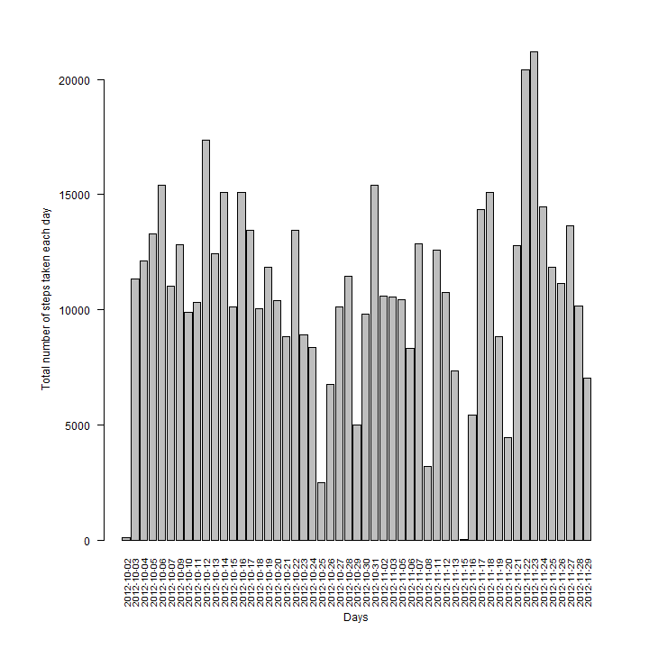
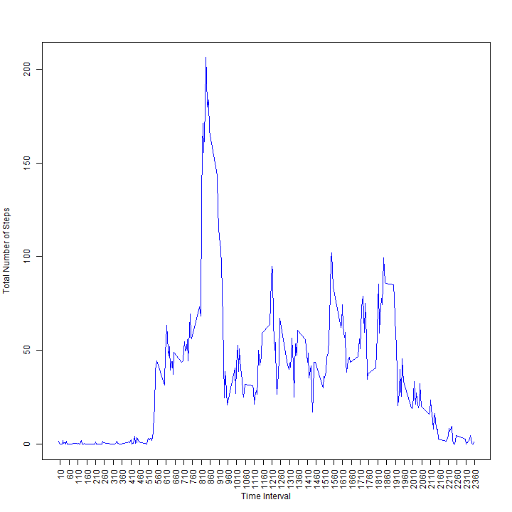
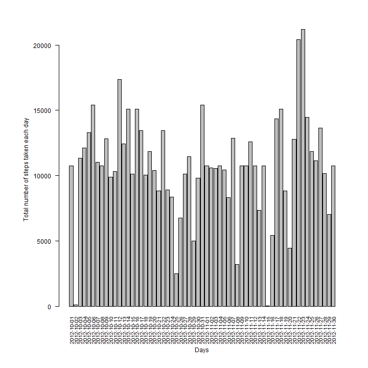
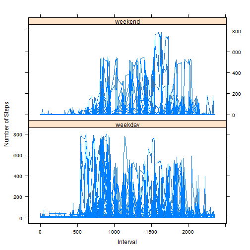

# Reproducible Research: Peer Assessment 1
========================================================

This is an R Markdown document for reproducible reasearch peer assignment 1.

This assignment makes use of data from a personal activity monitoring device. This device collects data at 5 minute intervals through out the day. The data consists of two months of data from an anonymous individual collected during the months of October and November, 2012 and include the number of steps taken in 5 minute intervals each day.

## Loading and preprocessing the data

The data for this assignment is included here:
- **Dataset**: activity.csv
	
The variables included in this dataset are:
- **steps**: Number of steps taking in a 5-minute interval (missing values are coded as NA)
- **date**: The date on which the measurement was taken in YYYY-MM-DD format
- **interval**: Identifier for the 5-minute interval in which measurement was taken

The dataset (activity.csv) is stored in a comma-separated-value (CSV) file and there are a total of 17,568 observations in this dataset. The compressed activity.zip file is also included.

  
	### 1. Set working directory and load data

```r
		##setwd("c:/courseera/DataScience/reproducible_research/CourseProject1")
		activity<-read.csv("activity/activity.csv",header=TRUE,na.strings = "NA")
		str(activity)
```

```
## 'data.frame':	17568 obs. of  3 variables:
##  $ steps   : int  NA NA NA NA NA NA NA NA NA NA ...
##  $ date    : Factor w/ 61 levels "2012-10-01","2012-10-02",..: 1 1 1 1 1 1 1 1 1 1 ...
##  $ interval: int  0 5 10 15 20 25 30 35 40 45 ...
```
	### 2. Format Data for analysis below

```r
      activity$date<-as.Date(activity$date, format = "%Y-%m-%d")
	  summary(activity)
```

```
##      steps            date               interval   
##  Min.   :  0.0   Min.   :2012-10-01   Min.   :   0  
##  1st Qu.:  0.0   1st Qu.:2012-10-16   1st Qu.: 589  
##  Median :  0.0   Median :2012-10-31   Median :1178  
##  Mean   : 37.4   Mean   :2012-10-31   Mean   :1178  
##  3rd Qu.: 12.0   3rd Qu.:2012-11-15   3rd Qu.:1766  
##  Max.   :806.0   Max.   :2012-11-30   Max.   :2355  
##  NA's   :2304
```

## What is mean total number of steps taken per day?

	### 0. Transform Data for this analysis

```r
		TotNumStepPerDay <-aggregate(activity$steps ~ activity$date,  FUN=sum, na.rm=TRUE) ## Removed any NA's
		names(TotNumStepPerDay)<-c("date","steps")
```
	### 1. Make a histogram of the total number of steps taken each day

```r
		par(mar=c(8,8,4,3))
		barplot(TotNumStepPerDay$steps,names.arg=TotNumStepPerDay$date,las=2,cex.names=0.8,width=1500)
		mtext(side=1,"Days",line=5)
		mtext(side=2,"Total number of steps taken each day",line=4)
```

 

	### 2. Calculate and report the mean and median total number of steps taken per day
	
		### Mean for total number of steps taken per day

```r
			mean(TotNumStepPerDay$steps)
```

```
## [1] 10766
```
		### Median for total number of steps taken per day

```r
			median(TotNumStepPerDay$steps)
```

```
## [1] 10765
```

## What is the average daily activity pattern?
	
	### 0. Transform Data for this analysis

```r
			StepsIntPerDay<-aggregate(activity$steps ~ activity$interval,  FUN=mean, na.rm=TRUE) ## Removed any NA's
			names(StepsIntPerDay)<-c("interval","steps")
```
	
	### 1. Make a time series plot (i.e. type = "l") of the 5-minute interval (x-axis) and 
	### 	 the average number of steps taken, averaged across all days (y-axis)
	

```r
			plot(StepsIntPerDay$interval,StepsIntPerDay$steps,type="l", 
				col="blue", xlab="Time Interval",ylab="Total Number of Steps",xaxt="n")
			axis(1, at = seq(10, 2400, by = 50), las=2)
```

 
     
	### 2. Which 5-minute interval, on average across all the days in the dataset, contains the maximum number of steps?


```r
			StepsIntPerDay[which(StepsIntPerDay$steps==max(StepsIntPerDay$steps)),]$interval
```

```
## [1] 835
```

## Imputing missing values

	### 1. Calculate and report the total number of missing values in the dataset (i.e. the total no. of rows with NAs)
		

```r
		sum(is.na(activity))
```

```
## [1] 2304
```

```r
		sum(is.na(activity$steps))
```

```
## [1] 2304
```

```r
        ##sum(is.na(activity$date))
		##sum(is.na(activity$interval))
```
		
	### 2. Strategy for filling in all of the missing values in the dataset : Set null steps to mean of steps 
		   for that 5-minute interval.


```r
		# Function to impute missing values
			imputeSteps<-function(activity) {
				# Get records with missing steps
				NArecs<-which(is.na(activity))
				
				# Get mean of steps for each 5-minute intervals
					meanStepsPerInterval<-aggregate(activity$steps ~ activity$interval,  FUN=mean, na.rm=TRUE)
					names(meanStepsPerInterval)<-c("interval","steps")
				
				# Fill the missing steps using that 5-minute interval
					for (i in 1:length(NArecs)) 
						{activity[NArecs[i],]$steps<-meanStepsPerInterval[meanStepsPerInterval$interval==
																activity[NArecs[i],]$interval,]$steps}
						
					activity
				}
```

	# 3. Create a new dataset that is equal to the original dataset but with the missing data filled in.


```r
				activity_impute<-	imputeSteps(activity)
				summary(activity_impute)
```

```
##      steps            date               interval   
##  Min.   :  0.0   Min.   :2012-10-01   Min.   :   0  
##  1st Qu.:  0.0   1st Qu.:2012-10-16   1st Qu.: 589  
##  Median :  0.0   Median :2012-10-31   Median :1178  
##  Mean   : 37.4   Mean   :2012-10-31   Mean   :1178  
##  3rd Qu.: 27.0   3rd Qu.:2012-11-15   3rd Qu.:1766  
##  Max.   :806.0   Max.   :2012-11-30   Max.   :2355
```

	# 4a. Make a histogram of the total number of steps taken each day 


```r
		TotNumStepPerDay <-aggregate(activity_impute$steps ~ activity_impute$date,  FUN=sum, na.rm=TRUE)
		names(TotNumStepPerDay)<-c("date","steps")
	
		par(mar=c(8,8,4,3))
		barplot(TotNumStepPerDay$steps,names.arg=TotNumStepPerDay$date,las=2,cex.names=0.8)
		mtext(side=1,"Days",line=5)
		mtext(side=2,"Total number of steps taken each day",line=4)
```

 

	# 4b. Calculate and report the mean and median total number of steps taken per day.


```r
		# Mean for total number of steps taken per day
			mean(TotNumStepPerDay$steps)
```

```
## [1] 10766
```

```r
		# Median for total number of steps taken per day
			median(TotNumStepPerDay$steps)
```

```
## [1] 10766
```

After imputing the data, mean remained the same but median changed a bit. Now both mean and median are same for this imputed dataset.

## Are there differences in activity patterns between weekdays and weekends?

	# 1.	Create a new factor variable in the dataset with two levels - "weekday" and "weekend" indicating 
			whether a given date is a weekday or weekend day.


```r
		# Function to take day of the week and return whether weekend or weekday.
			isweekday<-function(day_of_week) {
				if (day_of_week=="Sunday" || day_of_week=="Saturday") "weekend" else "weekday"
				}
		# Take date column and convert it to whether weekend or weekday.
			isweekend<-""
			for (i in 1:length(activity_impute$date) ) {		
					isweekend[i]<-isweekday(weekdays(activity_impute[i,]$date,abbreviate=FALSE))
					}
		# Create new variable in the data.frame for weekend/weekday
			activity_impute<-cbind(activity_impute,isweekend)
			
			library(lattice)	
			xyplot(activity_impute$steps ~ activity_impute$interval|activity_impute$isweekend,type="l", 
												layout=c(1, 2),xlab="Interval",ylab="Number of Steps")
```

 

In general weekdays activity seems higher than weekend. It also looks like day time activity between intervals 500-1000( around 8:30AM -4:30PM) is lot higher on weekdays than weekend.
